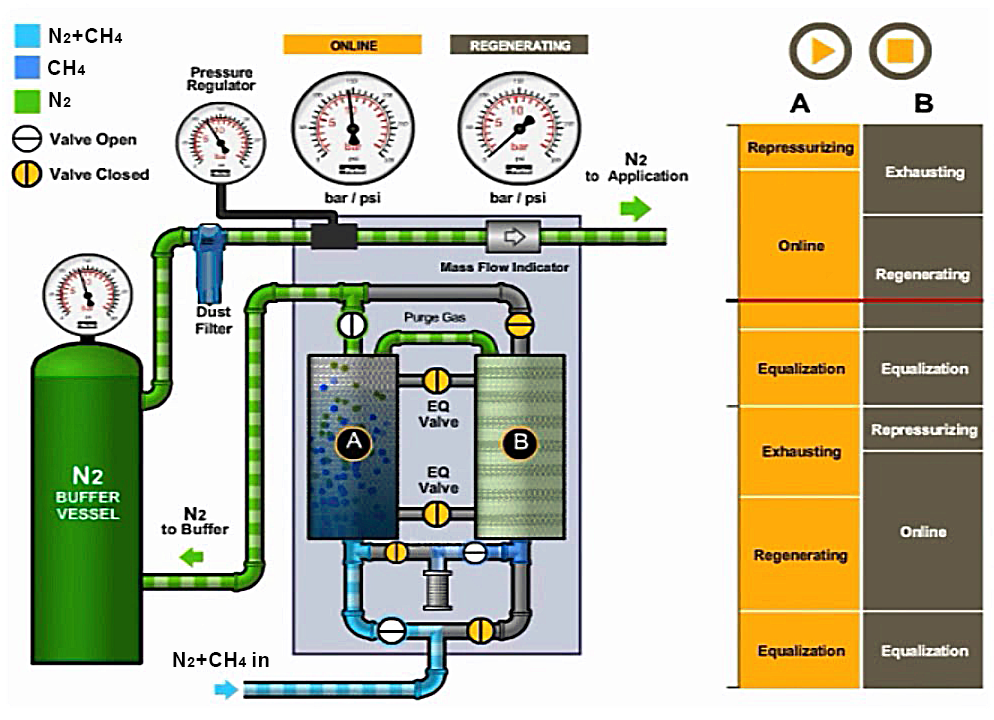

# <left></left> Pressure Swing Adsorption (PSA) project

The PSA application was developed by Mário H. Moura-Neto and Mateus F. Monteiro, both chemical engineering doctoral students of the Federal University of Rio Grande do Norte ([PPGEQ/UFRN](https://sigaa.ufrn.br/sigaa/public/programa/portal.jsf?id=106)). The project was supervised by Prof. Dr. [Ivanovitch M. D. Silva](https://github.com/ivanovitchm) ([PPgEEC/UFRN](https://sigaa.ufrn.br/sigaa/public/programa/portal.jsf?id=103)) along the Machine Learning course.
We'll be looking at the efficiency of Nitrogen (N2) separation from a CH4-N2 feed stream by a solid-bed column. Twelve parameters were monitored in order to determine their influence on N2 separation.

PSA is a cyclic adsorption process for gas separation and purification. PSA offers a wide range of device design, resulting in high applicability for several different systems. Recently, much attention has been devoted to the simulation and optimization of multiple PSA cycles. The process consists in the use of solid-adsorbent beds to separate impurities from a stream of gases. Thus, leading to a high-purity high-pressure stream of the interest gas (in this case, N2) and a low-pressure tail gas stream containing the impurity (CH4) and some of the nitrogen. As shown in the figure, two parallel adsorbent columns opperate in an alternating setup. While one is active, the other is going through a regeneration process.

Detailed and high-complexity mathematical models make design difficult. So, machine learning represents a powerfull approch to this problem, as in several other areas of chemical engineering. The proposed methodology takes into account 12 parameters (Table 1) of the PSA unit and uses them to determined no molar concentration of N2 (Table 2) in the purified stream.

A database of 1300 datapoints was published (CSV file) by Sant Anna et al. (2017) regarding the N2-CH4 PSA unit. Data of several sensors (e.g. temperature, pressure and volumetric flow) and residence time of the fluid (gas mixture) inside the solid-bed column. The CSV file contains 13 columns, the target one (i.e. the value we wish to predict) is the N2 concentration (mole fraction) in the N2 recovery stream.

The following pipeline steps were considered: _**1**_. Fetch data, _**2**_. Exploratory Data Analysis (EDA), _**3**_. Preprocessing, _**4**_. Data Check, _**5**_. Data segregation, _**6**_. Train and _**7**_. Test.

<strong> Simplified schematics of a PSA unit. </strong>

  

Adapted from: [Parker Hannifin Corp](https://www.parker.com)

It is also noteworthy that a **Model Card** of the application is available. To see it just browse the model_card folder in this repository.

:small_blue_diamond: **Table 1 - PSA parameters (input):**
| Name of the parameter | Variable name in the code and in the Heroku's .json input | Default value | Limits | 
| ------ | ------ | ------ | ------ |
| Adsorption pressure (bar) | Adsorp_pres | 4.8 | [4,6] | 
| Co-current blowdown pressure (bar) | CoCur_BlowPres | 4.5 | [4,6] | 
| Counter-current blowdown pressure (bar) | CountCur_pres | 0.13 | [0.1,0.2] | 
| Adsorption time (s) | Adsorp_time | 53.5 | [20,60] | 
| Co-current desorption time (s) | CoCur_desorp_time | 30.5 | [10,50] | 
| Counter-current desorption time (s) | CountCur_desorp_time | 33.0 | [10,50] | 
| Compression time (s) | Compres_time | 21.9 | [20,30] | 
| Volumetric flow (m3·s-1) | Vol_flow | 0.001 | [0.001, 0.003] | 
| Temperature (K) | Temp | 296.3 | [273,323] | 
| Column length (m) | Col_length | 1.3 | [1,3] | 
| Column diameter (m) | Col_diam | 0.26 | [0.1,0.3] | 
| Feed nitrogen mole fraction | Feed_N2_mf | 0.76 | [0.1,0.9] | 

:small_orange_diamond: **Table 2 - PSA parameter (output):**

| Name of the parameter | Variable name in the code and in the Heroku's .json input | Limits | 
| ------ | ------ | ------ |
| N2 mole fraction in the purified stream | PurStream_N2_mf | [0,1] | 

## :computer: Development

This application was developed and published online regarding the following tools:
- [Google Colaboratory](https://colab.research.google.com) 
   - Python 3 was applied to perform the steps of Extract, Transform and Load (ETL) the data. Exploratory Data Analysis (EDA), Fetch Data, EDA using Pandas-Profiling and Preprocessing were properly carried out. The scikit-learn library was used to develop the pipeline methodology.

- [Conda](https://docs.conda.io/en/latest/)
   - It was used to create and manage a virtual enviroment with the required packages.
- [Weights & Biases](https://wandb.ai/site) (Wandb)
  - Wandb was applied during the complete pipeline process, as it can be used to automatically create and store the necessary artifacts, e.g., train, validation, test, and model inference artifacts.  
- [FastAPI](https://fastapi.tiangolo.com/)
   - Web framework for developing RESTful Application Programming Interface (API) in Python. It was used to create the app and manage the application's requests and responses.
- [Jupyter Notebook](https://jupyter.org/)
   - Jupyter is the open source project on which Google Colab is based. It was applied to magage and run the project's files while testing the API.
- [Github](https://github.com/)
   - GitHub was chosen to host the source code and other required project files for its easy integration with several other applications and the broad user community. 
- [Heroku](https://www.heroku.com/)
   - Heroku was used to deploy the application. It is a cloud platform service that offers a free experience on the web implementation. Furthermore, it also supports multiple programming languages, which provides nice flexibility for possible future upgrades.   

## :rotating_light: Attention
- The application shall be used whithin the studied parameter's limits.
- The obtained calculation results should be interpreted with the adequate care and analysis.   

## :grey_exclamation: Important Material

| Material | Hyperlink |
| ------ | ------ |
| Database publisher | [Paper, Sant Anna et al. (2017)](https://www.sciencedirect.com/science/article/abs/pii/S0098135417302053) |
| Web Application | [Online App](https://psa-unit.herokuapp.com) |
| Medium article | [Online Article](https://medium.com/@labsimulacao.nupeg/psa-unit-for-nitrogen-purification-machine-learning-approach-using-decission-tree-regressor-3cdba58c9697) |

## :bookmark_tabs: License

GNU General Public License v3.0 - [Legal](https://www.gnu.org/licenses/gpl-3.0.html)

**Feel free to test and use the application!**

[//]: # (If desired to use multiple references along the markdown file, the links used in the body of the note can be substituted by keywords, then the links get stripped out when the markdown processor does its job. There is no need to format nicely because it shouldn't be seen. For example:)
   [repo]: <https://github.comr>
